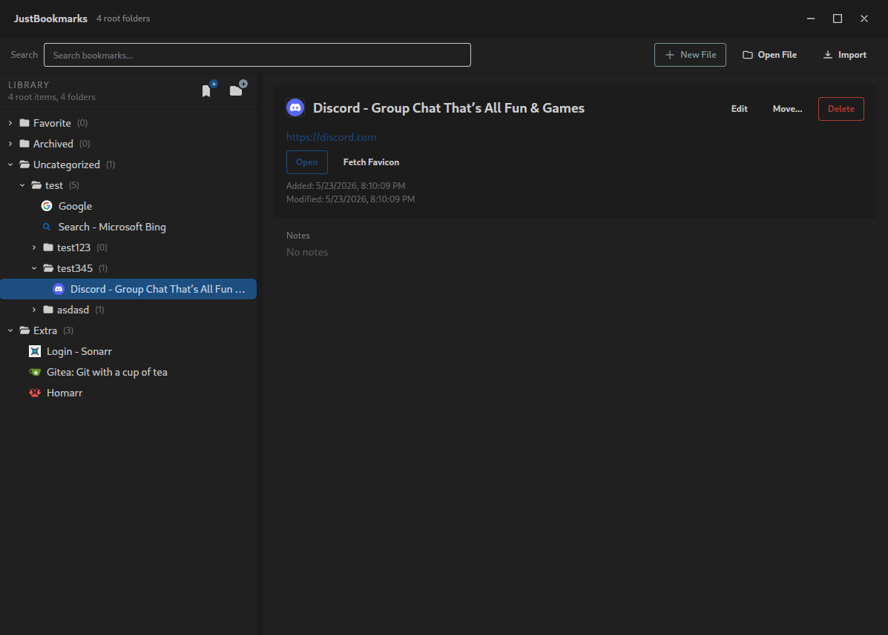
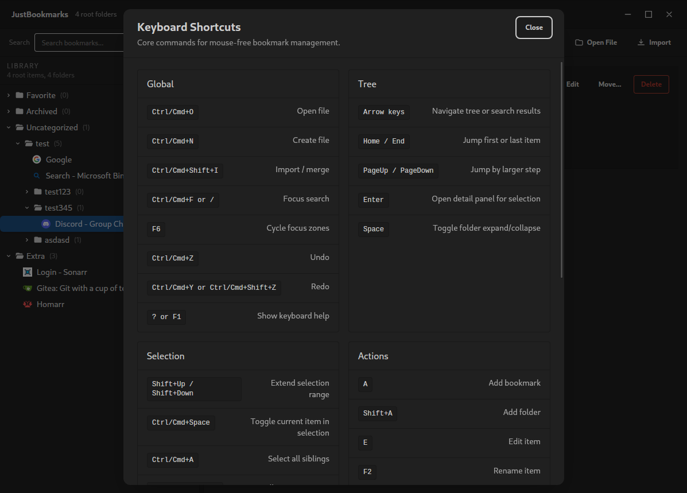

# JustBookmarks

`JustBookmarks` is a simple desktop bookmark manager for people who want one clean, browser-independent source of truth.

It keeps everything in a plain Netscape Bookmarks HTML file, so you can manage your bookmarks outside of any specific browser and import them wherever you want later.



## Download

Prebuilt binaries are available on GitHub Releases:

- https://github.com/SellswordSoftware/justbookmarks/releases/latest

If you just want to use the app, that is the easiest place to start.

## Why I Made This

I end up switching browsers somewhat regularly: Vivaldi, Zen, Helium, Brave, and whatever else I am trying that month.

What I wanted was straightforward:

- one central book of record for my bookmarks
- an easy way to organize and clean them up
- a format I could import into basically any browser

Most of the tools I found were not a good fit.

- Some were online services like `raindrop.io`
- Some were more complex than I wanted, like `linkwarden`

`JustBookmarks` is meant to be simple but complete. It is not trying to be a research tool, a cloud product, or a giant personal knowledge system. It is just an easy way to manage your bookmarks in one place.

## How It Works

The app uses the **Netscape Bookmark File Format**, which is still the most compatible format for importing bookmarks into browsers.

That means:

- no proprietary database
- no required sync service
- no special export format to learn
- just one `.html` file

It is not fancy, and it does not support tags, but it does support folders, nested organization, search, editing, moving, and import/merge workflows.

You only have to manage one bookmark file. You can sync it, back it up, or version it however you like, because at the end of the day it is just a normal file on disk.

## Keyboard Help

The app includes a built-in shortcut and workflow reference.

Press `?` or `F1` at any time to open it.



## What You Can Do

- Open and manage a single bookmark HTML file
- Browse bookmarks in a folder tree
- Search bookmarks instantly
- Add, edit, move, and delete bookmarks and folders
- Refresh titles and favicons
- Import and merge another bookmark file
- Undo and redo changes
- Work primarily from the keyboard if you want to stay off the mouse

## Basic Workflow

1. Open an existing Netscape bookmark file, or create a new one.
2. Organize your folders and bookmarks.
3. Save happens automatically as you work.
4. Import that same file into whichever browser you are using today.

That is the whole idea: one file, one source of truth, less browser lock-in.

## Development

If you do not already have Wails installed, follow the official installation guide:

- https://wails.io/docs/gettingstarted/installation

Run the app in live development mode:

```bash
wails dev
```

This starts the Wails app with the frontend dev server for fast iteration.

### Frontend Docs

For frontend work, start with:

- `docs/agent-project-context.md`
- `docs/frontend-architecture.md`
- `docs/frontend-maintainability-guidelines.md`
- `docs/naf-html-usage-guidelines.md`
- `guide.md`

## Building

Build a production desktop app:

```bash
wails build
```
